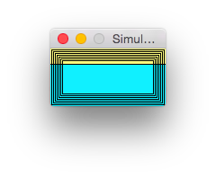

# SSD1306-AVR

SSD1306-AVR is a C++ library for using SSD1306, 128x64, monochrome OLED displays. Currently only the I2C version of the display is supported.

The I2C address of the display is set up in SSD1306.h :
```C
#define SSD1306_DEFAULT_ADDRESS 0x78
```

The library is written in pure C++. You'll only need avr-libc, Arduino framework is not needed.

This library is released under a VERY permissive license. Do anything with it, but if something goes wrong, it is YOUR problem (= NO WARRANTY AT ALL).

## Example code (no framebuffer used)

```C++
#include <stdint.h>
#include "SSD1306.h"

int main(void) {
    // This is our buffer
    // Each byte = 8 pixels on the screen
    uint8_t buffer[1024];

    // Only two lines of code to initiate the driver
    // and to send our framebuffer
    SSD1306 myDisplay;
    myDisplay.sendFramebuffer(buffer);

    // Hardware function to reverse the pixels
    // (swap black and white pixel)
    myDisplay.invert(1);
    // Revert back to normal display
    myDisplay.invert(0);

    return 0;
}
```

## Another example code (using the framebuffer)

```C++
#include <stdint.h>
#include "Framebuffer.h"

int main(void) {
    Framebuffer fb;

    fb.drawRectangle(1,1,126,62);
    fb.drawRectangle(3,3,124,60);
    fb.drawRectangle(5,5,122,58);
    fb.drawRectangle(7,7,120,56);
    fb.drawRectangle(9,9,118,54);
    fb.drawRectangle(11,11,116,52);
    fb.drawRectangle(13,13,114,50);
    
    fb.show();

    return 0;
}
```

As you can see the framebuffer API is quite easy to understand.

## Images !

You can display images using the Framebuffer, though you will need to convert those images using [Esther](https://github.com/tibounise/Esther).

```C++
#include <stdint.h>
#include <avr/pgmspace.h>
#include "Framebuffer.h"

const uint8_t image[] PROGMEM = {
    ...
};

int main(void) {

    Framebuffer fb;

    fb.drawBitmap(image,64,128,0,0);
    
    fb.show();

    return 0;
}
```

## SSD1306 simulator

It is very experimental, maybe not usefull.



There are some example programs using the simulator, in `/examples/`. Compile the simulator (requires SDL2) and the example program, then run your example program like this :

```shell
./examples/example1/example1 | ./simulator/simulator
```

## Looking for your support

If you would like to see 128x32 displays (or any other I2C SSD1306-based displays) supported by my library, please do a donation, so that I could buy one of those displays to improve my library.

I currently accept [PayPal](https://www.paypal.com/cgi-bin/webscr?cmd=_s-xclick&hosted_button_id=K65LZXQXASC8E) and [Bitcoin](https://blockchain.info/address/13XFkvDBm8iqbwVC1egYZ8sCSu72eebJ7N) donations.
